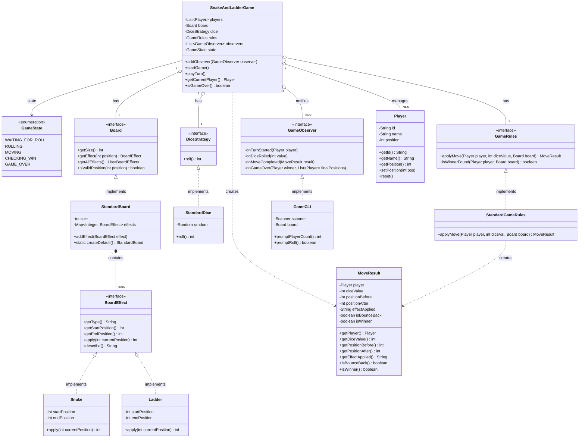

# Snakes & Ladders - UML Design

This document describes the low-level design of the Snake & Ladder game using Merlin UML. It leverages core design patterns like Strategy, Observer, and SOLID principles.

## 🧱 Key Design Patterns
- **Strategy Pattern**: Used for `DiceStrategy` (swappable dice behavior) and `GameRules` (swappable win/movement rules).
- **Observer Pattern**: Used to decouple the `SnakeAndLadderGame` core from the UI/CLI via `GameObserver`.
- **Factory/Static Creation**: Utilized in `StandardBoard` for default configuration.

## 📊 Class Diagram

## 🛠️ Design Rationale

1. **Board decoupling**: The `Board` doesn't know *how* to apply moves; it only knows its configuration and size. 
2. **Strategy for Rules**: `GameRules` allows us to change the winning condition (e.g., must land exactly on 100 vs. cross 100) or movement mechanics without altering the `Game` class.
3. **Observability**: The `GameObserver` allows external UI components to hook into game events. This makes it trivial to swap the CLI for a GUI or web interface later.
4. **Immutability of Results**: `MoveResult` acts as a Data Transfer Object (DTO), ensuring that once a move is calculated, its details are preserved and cannot be tampered with by other components.
